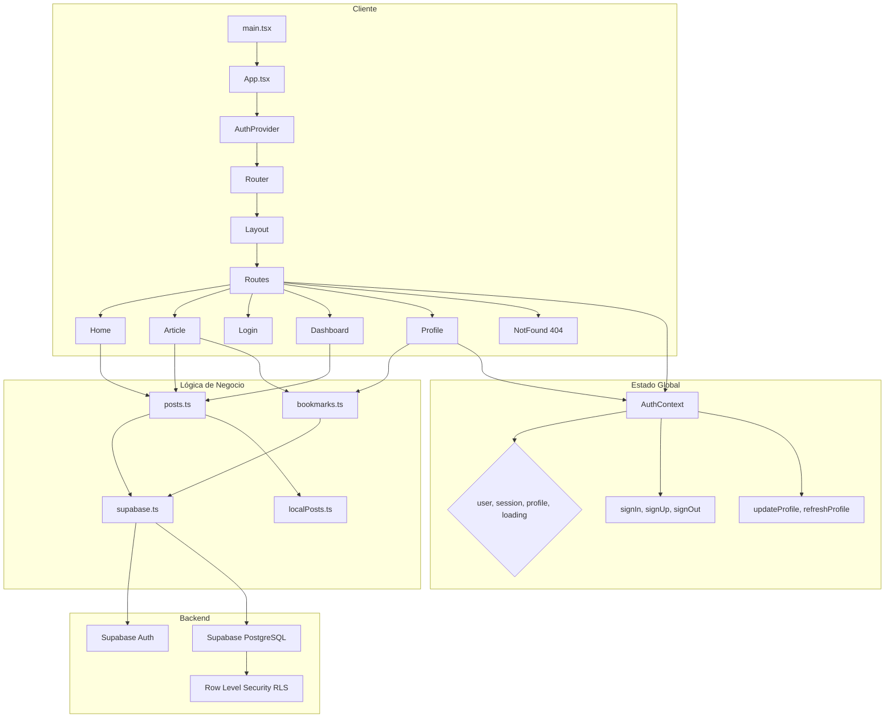

# Especificación del Proyecto — CamiDante

---

## 1. Datos del proyecto

| Campo                 | Valor                                       |
| --------------------- | ------------------------------------------- |
| **Nombre**            | CamiDante                                   |
| **Fecha de creación** | ~Mayo 2025                                  |
| **Última actualización** | 24 de junio de 2026                      |
| **Versión actual**    | 0.0.0 (en desarrollo)                       |
| **Repositorio**       | `D:\camidante` (local)                      |
| **Tipo de proyecto**  | Blog / diario digital de pensamiento lento  |

---

## 2. Descripción general

### Propósito

CamiDante es un espacio digital minimalista diseñado para la publicación de ensayos, reflexiones y contenido artístico. Su filosofía central es la **"artesanía del pensamiento lento"**: un contrapunto a la velocidad y el ruido de los medios digitales convencionales. Funciona como un blog personal donde el contenido se clasifica en categorías temáticas (Escritos, Pensamientos, Arte, Archivo) y ofrece una experiencia de lectura pausada y estética.

### Funcionalidades principales

- **Exploración de artículos** — Página principal con diseño de cuadrícula variable (grande, mediano, pequeño) con soporte para contenido destacado (*featured*).
- **Lectura de artículo individual** — Vista de artículo con Markdown renderizado, metadatos (categoría, etiquetas, fecha, tiempo de lectura), y bloque de autor.
- **Búsqueda y filtrado** — Búsqueda por texto libre y filtrado por categoría vía _query string_.
- **Autenticación de usuarios** — Registro e inicio de sesión con email/contraseña mediante Supabase Auth.
- **Perfil de usuario** — Visualización y edición del perfil (nombre), con colección de artículos guardados (marcadores).
- **Panel de administración** — CRUD completo de artículos (crear, editar, eliminar) con estadísticas básicas.
- **Marcadores (*bookmarks*)** — Usuarios autenticados pueden guardar artículos en su colección personal.
- **Fallback local** — Cuando Supabase no está configurado o la tabla está vacía, el sistema utiliza datos de semilla locales para demostración.

---

## 3. Stack tecnológico

### Frontend

| Tecnología        | Versión      | Propósito                                      |
| ----------------- | ------------ | ---------------------------------------------- |
| **React**         | ^19.0.1      | Biblioteca UI                                  |
| **TypeScript**    | ~5.8.2       | Tipado estático                                |
| **Vite**          | ^6.2.3       | Bundler y dev server                           |
| **TailwindCSS**   | ^4.1.14      | Framework CSS utility-first (v4)               |
| **React Router**  | ^7.15.0      | Enrutamiento SPA                               |
| **Motion**        | ^12.23.24    | Animaciones (antes Framer Motion)              |
| **Lucide React**  | ^0.546.0     | Iconos SVG                                     |
| **react-markdown**| ^10.1.0      | Renderizado de Markdown                        |

### Backend / Base de datos

| Tecnología              | Versión      | Propósito                          |
| ----------------------- | ------------ | ---------------------------------- |
| **Supabase**            | —            | BaaS (Auth + PostgreSQL + RLS)     |
| **@supabase/supabase-js** | ^2.105.4  | Cliente oficial Supabase           |

### Herramientas de desarrollo

| Herramienta     | Versión   | Propósito                       |
| --------------- | --------- | ------------------------------- |
| **TypeScript**  | ~5.8.2    | Compilador TS                   |
| **@types/node** | ^22.14.0  | Tipos Node.js                   |
| **Vite**        | ^6.2.3    | Desarrollo y build              |
| **@vitejs/plugin-react** | ^5.0.4  | Plugin React para Vite |
| **@tailwindcss/vite** | ^4.1.14 | Plugin TailwindCSS para Vite   |
| **rimraf**      | — (npx)   | Limpieza de directorio `dist/`  |

### Configuración de build (Vite)

- **Alias**: `@` → raíz del proyecto (`./`)
- **Code splitting** manual:
  - `react`: react, react-dom, react-router-dom
  - `supabase`: @supabase/supabase-js
  - `motion`: motion
  - `markdown`: react-markdown
  - `icons`: lucide-react
- **Dev server**: puerto 3000, host 0.0.0.0, HMR condicional (variable `DISABLE_HMR`)

---

## 4. Estructura del proyecto

```
D:\camidante/
├── index.html                          # Entry point HTML
├── package.json                        # Dependencias y scripts
├── tsconfig.json                       # Configuración TypeScript
├── vite.config.ts                      # Configuración de Vite
├── metadata.json                       # Metadatos del proyecto (AI Studio)
├── README.md                           # Documentación de inicio
├── .env.example                        # Plantilla de variables de entorno
├── .env.local                          # Variables de entorno reales (ignorado en git)
├── .gitignore                          # Archivos ignorados por git
│
├── src/                                # Código fuente de la aplicación
│   ├── main.tsx                        # Punto de entrada React (renderiza <App />)
│   ├── App.tsx                         # Componente raíz: Router + Layout + Rutas
│   ├── index.css                       # Estilos globales + tema TailwindCSS
│   │
│   ├── components/                     # Componentes reutilizables de UI
│   │   ├── AdminRoute.tsx              # Guard de ruta: solo administradores
│   │   ├── BookmarkButton.tsx          # Botón para guardar/quitar marcador
│   │   ├── CategoryBadge.tsx           # Etiqueta de categoría
│   │   ├── DateLabel.tsx               # Formateador de fecha en español
│   │   ├── Footer.tsx                  # Pie de página global
│   │   ├── Navbar.tsx                  # Barra de navegación superior (sticky)
│   │   ├── PostForm.tsx                # Formulario para crear/editar posts (admin)
│   │   ├── PostList.tsx                # Lista de posts con acciones (admin)
│   │   ├── Sidebar.tsx                 # Barra lateral de navegación (admin)
│   │   └── StatCard.tsx                # Tarjeta de estadística con animación
│   │
│   ├── context/                        # Proveedores de contexto React
│   │   └── AuthContext.tsx             # Contexto de autenticación (AuthProvider + useAuth)
│   │
│   ├── data/                           # Datos de demostración / semilla
│   │   └── localPosts.ts              # 4 artículos de fallback offline
│   │
│   ├── lib/                            # Lógica de negocio y utilidades
│   │   ├── config.ts                   # Constantes del sitio (nombre, categorías, autor)
│   │   ├── supabase.ts                 # Cliente Supabase singleton + detección de configuración
│   │   ├── posts.ts                    # Operaciones CRUD de posts (con fallback local)
│   │   └── bookmarks.ts               # Operaciones de marcadores (toggle, list)
│   │
│   ├── pages/                          # Componentes de página (lazy-loaded)
│   │   ├── Home.tsx                    # Página principal con grid de artículos
│   │   ├── Article.tsx                 # Vista de artículo individual
│   │   ├── Dashboard.tsx               # Panel de administración (CRUD + stats)
│   │   ├── Login.tsx                   # Página de inicio de sesión / registro
│   │   └── Profile.tsx                 # Perfil de usuario + colección guardada
│   │
│   └── types/                          # Definiciones de tipos TypeScript
│       ├── post.ts                     # Tipos Post, PostLayoutSize, PostListFilters
│       └── database.ts                 # Tipos Supabase (Database, DbPost, DbProfile, etc.)
│
├── supabase/                           # Configuración de Supabase
│   └── migrations/                     # Migraciones SQL
│       ├── 20250512000000_init.sql           # Schema inicial + RLS + triggers
│       ├── 20250512120000_seed_local_posts.sql  # Datos de semilla (4 posts)
│       └── 20260607120000_fix_profile_policy.sql  # Fix política RLS de perfiles
│
├── scripts/                            # Scripts auxiliares
│   └── generate-seed-sql.mjs           # Genera la migración de seed desde datos JS
│
├── dist/                               # Directorio de build (ignorado en git)
└── node_modules/                       # Dependencias (ignorado en git)
```

---

## 5. Arquitectura

### Diagrama de arquitectura general



### Decisiones arquitectónicas clave (ADRs)

#### ADR-1: Fallback local como estrategia de desarrollo y demostración

- **Contexto**: El proyecto puede ejecutarse sin una instancia de Supabase configurada.
- **Decisión**: Se implementó un sistema de **fallback local** mediante el constante `ENABLE_LOCAL_FALLBACK`. Si Supabase no está configurado (`VITE_SUPABASE_URL`/`VITE_SUPABASE_ANON_KEY` ausentes) o la tabla está vacía o hay error de red, la app recurre a un array de posts en `src/data/localPosts.ts`.
- **Consecuencias**: 
  - El frontend puede desarrollarse y mostrarse completamente offline.
  - La lógica de consulta tiene que verificar múltiples condiciones de fallback.
  - Los datos de fallback y la semilla SQL se mantienen sincronizados manualmente (vía `generate-seed-sql.mjs`).

#### ADR-2: Code Splitting manual por librería

- **Contexto**: Vite con `manualChunks` para separar el bundle.
- **Decisión**: Se agruparon las dependencias en chunks separados (React, Supabase, Motion, Markdown, Iconos) para optimizar el caché del navegador y reducir el tamaño del bundle inicial.
- **Consecuencias**: Carga inicial más rápida, mejor caché de librerías que cambian con menos frecuencia.

#### ADR-3: Consumo directo de Supabase (sin ORM)

- **Contexto**: La app interactúa con Supabase sin un ORM adicional como Prisma o Drizzle.
- **Decisión**: Se utiliza el cliente `@supabase/supabase-js` directamente, con tipos generados manualmente en `src/types/database.ts`.
- **Consecuencias**: Menos dependencias, control total sobre las queries, pero los tipos de BD deben mantenerse a mano.

#### ADR-4: Layout condicional según la ruta

- **Contexto**: El Dashboard (admin) requiere un layout diferente (sin Navbar ni Footer, con Sidebar).
- **Decisión**: El componente `Layout` en `App.tsx` detecta si la ruta comienza con `/dashboard` y oculta condicionalmente Navbar y Footer.
- **Consecuencias**: Lógica simple sin anidamiento de layouts; el Sidebar se renderiza dentro de la página `Dashboard` directamente.

---

## 6. Modelos de datos

### 6.1 Tablas en Supabase (PostgreSQL)

#### Tabla `posts`

| Columna          | Tipo                        | Restricciones              | Descripción                            |
| ---------------- | --------------------------- | -------------------------- | -------------------------------------- |
| `id`             | `uuid`                      | PK, `gen_random_uuid()`    | Identificador único                    |
| `slug`           | `text`                      | UNIQUE, nullable           | Slug legible para URL                  |
| `title`          | `text`                      | NOT NULL                   | Título del artículo                    |
| `excerpt`        | `text`                      | NOT NULL                   | Extracto / resumen breve               |
| `body`           | `text`                      | NOT NULL, default `''`     | Cuerpo en Markdown                     |
| `category`       | `text`                      | NOT NULL                   | Categoría (ver constantes)             |
| `cover_image`    | `text`                      | NOT NULL                   | URL de imagen de portada               |
| `reading_minutes`| `int`                       | NOT NULL, default `5`      | Tiempo estimado de lectura             |
| `published`      | `boolean`                   | NOT NULL, default `false`  | Estado de publicación                  |
| `published_at`   | `timestamptz`               | nullable                   | Fecha de publicación                   |
| `tags`           | `text[]`                    | NOT NULL, default `{}`     | Array de etiquetas                     |
| `featured`       | `boolean`                   | NOT NULL, default `false`  | Artículo destacado (portada)           |
| `size`           | `text`                      | nullable                   | Tamaño en layout (`large`, `medium`, `small`) |
| `created_at`     | `timestamptz`               | NOT NULL, default `now()`  | Fecha de creación                      |
| `updated_at`     | `timestamptz`               | NOT NULL, default `now()`  | Fecha de última modificación           |

#### Tabla `profiles`

| Columna      | Tipo          | Restricciones                                  | Descripción             |
| ------------ | ------------- | ---------------------------------------------- | ----------------------- |
| `id`         | `uuid`        | PK, FK → `auth.users` ON DELETE CASCADE        | ID del usuario          |
| `full_name`  | `text`        | nullable                                       | Nombre completo         |
| `avatar_url` | `text`        | nullable                                       | URL del avatar          |
| `is_admin`   | `boolean`     | NOT NULL, default `false`                      | Es administrador        |
| `updated_at` | `timestamptz` | default `now()`                                | Última actualización    |

#### Tabla `bookmarks`

| Columna      | Tipo          | Restricciones                                         | Descripción                |
| ------------ | ------------- | ----------------------------------------------------- | -------------------------- |
| `user_id`    | `uuid`        | PK, FK → `auth.users` ON DELETE CASCADE               | ID del usuario             |
| `post_id`    | `uuid`        | PK, FK → `public.posts` ON DELETE CASCADE             | ID del artículo            |
| `created_at` | `timestamptz` | NOT NULL, default `now()`                             | Fecha en que se guardó     |

### 6.2 Tipos TypeScript

#### `Post` (src/types/post.ts)

```typescript
interface Post {
  id: string;
  slug: string | null;
  title: string;
  excerpt: string;
  body: string;
  category: string;
  published_at: string | null;
  cover_image: string;
  reading_minutes: number;
  published: boolean;
  tags: string[];
  featured: boolean;
  size: PostLayoutSize | null;
}
```

#### `DbPost` / `DbPostInsert` (src/types/database.ts)

```typescript
// Row completa de la tabla posts
type DbPost = Database['public']['Tables']['posts']['Row'];

// Para inserción (con valores default opcionales)
type DbPostInsert = Database['public']['Tables']['posts']['Insert'];

// Perfil desde BD
type DbProfile = Database['public']['Tables']['profiles']['Row'];
```

#### `PostFormState` (componente PostForm)

```typescript
interface PostFormState {
  title: string;
  excerpt: string;
  body: string;
  category: string;
  cover_image: string;
  reading_minutes: number;
  published: boolean;
  tags: string;       // Separado por comas (input text)
  slug: string;
  featured: boolean;
  size: Post['size'];
}
```

### 6.3 Relaciones

```
auth.users (Supabase)
    1│
    1│
    ├── profiles   (id → auth.users.id)
    │
    │   Un usuario puede ser admin (is_admin = true)
    │
    └── bookmarks  (user_id → auth.users.id)
                      │
                      │ M:N
                      │
                 posts  (post_id → posts.id)
```

### 6.4 Row Level Security (RLS)

| Tabla       | Operación | Política                                           |
| ----------- | --------- | -------------------------------------------------- |
| **posts**   | SELECT    | Público si `published = true`; admins ven todo     |
| **posts**   | INSERT    | Solo admins                                        |
| **posts**   | UPDATE    | Solo admins                                        |
| **posts**   | DELETE    | Solo admins                                        |
| **profiles**| SELECT    | Solo el propio usuario                             |
| **profiles**| UPDATE    | Solo el propio usuario (sin cambiar `is_admin`)    |
| **bookmarks**| ALL     | Solo el propio usuario                             |

### 6.5 Trigger automático

Al crear un usuario en `auth.users`, se dispara `handle_new_user()` que inserta automáticamente un registro en `profiles` con el `id` y `full_name` de los metadatos.

---

## 7. API / Interfaces

### 7.1 Funciones del módulo `lib/posts.ts`

| Función                   | Visibilidad | Descripción                                       |
| ------------------------- | ----------- | ------------------------------------------------- |
| `listPosts(filters?)`     | Pública     | Lista posts publicados, ordenados por fecha DESC, con filtros opcionales (categoría, texto). Fallback local activo. |
| `getPostById(idOrSlug)`   | Pública     | Obtiene un post publicado por ID (UUID) o slug. Fallback local. |
| `listAllPostsAdmin()`     | Admin       | Lista todos los posts (publicados y borradores), ordenados por `updated_at` DESC. |
| `createPostAdmin(insert)` | Admin       | Crea un nuevo post. Retorna `{ok, id}` o `{ok, error}`. |
| `updatePostAdmin(id, patch)` | Admin    | Actualiza un post existente (setea `updated_at` automáticamente). |
| `deletePostAdmin(id)`     | Admin       | Elimina un post por ID.                           |
| `rowToPost(row)`          | Interna     | Convierte `DbPost` (BD) → `Post` (frontend).     |
| `postToInsert(p)`         | Interna     | Convierte `Partial<Post>` → `DbPostInsert` con defaults. |
| `getLocalFallbackPosts()` | Interna     | Retorna copia de los posts de fallback local.     |

### 7.2 Funciones del módulo `lib/bookmarks.ts`

| Función                      | Descripción                                    |
| ---------------------------- | ---------------------------------------------- |
| `isBookmarked(postId, userId)` | Verifica si un usuario tiene marcado un post |
| `toggleBookmark(postId, userId)` | Alterna el marcador (agrega/elimina)     |
| `listBookmarkedPosts(userId)` | Lista todos los posts marcados por un usuario |

### 7.3 Funciones del módulo `context/AuthContext.tsx`

| Método / Propiedad   | Tipo                                    | Descripción                                   |
| -------------------- | --------------------------------------- | --------------------------------------------- |
| `user`               | `User \| null`                          | Usuario autenticado de Supabase               |
| `session`            | `Session \| null`                       | Sesión activa                                 |
| `profile`            | `DbProfile \| null`                     | Perfil desde tabla `profiles`                 |
| `loading`            | `boolean`                               | Combinación de `authLoading` + `profileLoading` |
| `signIn(email, password)`  | `Promise<{error?: string}>`        | Inicio de sesión con email/contraseña         |
| `signUp(email, password, fullName?)` | `Promise<{error?: string}>` | Registro de nuevo usuario          |
| `signOut()`          | `Promise<void>`                         | Cierre de sesión                              |
| `updateProfile(patch)`  | `Promise<{error?: string}>`         | Actualiza nombre/avatar del perfil            |
| `refreshProfile()`   | `Promise<void>`                         | Recarga el perfil desde BD                    |

### 7.4 Constantes del sistema (`lib/config.ts`)

```typescript
SITE_NAME = 'CamiDante'
SITE_TAGLINE = 'A quiet space for creative thought.'
SITE_DESCRIPTION = 'Explorando la intersección entre el arte, la palabra y la reflexión pausada...'
ENABLE_LOCAL_FALLBACK = true en dev o si VITE_ENABLE_LOCAL_FALLBACK = 'true'
CATEGORIES = ['Escritos', 'Pensamientos', 'Arte', 'Archivo']
SOCIAL_LINKS = { instagram, twitter, github, mail }
AUTHOR = { name: 'CamiDante', bio: '...', avatar: null }
```

---

## 8. Sistema de rutas

### 8.1 Rutas navegables

| Ruta            | Componente     | Tipo de acceso | Descripción                                  |
| --------------- | -------------- | -------------- | -------------------------------------------- |
| `/`             | `Home`         | Público        | Página principal con grid de artículos       |
| `/read/:id`     | `Article`      | Público        | Vista de artículo por ID o slug              |
| `/login`        | `Login`        | Público        | Inicio de sesión / registro                  |
| `/dashboard`    | `Dashboard`    | Admin          | Panel de administración CRUD                 |
| `/profile`      | `Profile`      | Autenticado    | Perfil del usuario + colección de marcadores |
| `*`             | `NotFound`     | Público        | Página 404                                   |

### 8.2 Protección de rutas

- **`/dashboard`**: Envuelta en `<AdminRoute>`, que verifica:
  1. Si `loading` → muestra "Cargando..."
  2. Si no hay `user` → redirige a `/login` guardando la ruta de origen en `state.from`
  3. Si el usuario no es admin (`profile.is_admin !== true`) → redirige a `/`
- **`/profile`**: Verifica dentro del componente si hay `user`; si no, redirige a `/login` con `state.from = '/profile'`.

### 8.3 Parámetros de búsqueda (Home)

- `?category=Categoria` — Filtra posts por categoría exacta
- `?q=texto` — Búsqueda de texto libre en título, extracto, cuerpo y categoría

---

## 9. Flujo de autenticación

```
┌─────────────┐     ┌──────────────┐     ┌──────────────┐
│  Usuario no  │────>│  /login      │────>│  AuthContext  │
│  autenticado │     │              │     │  signIn/signUp│
└─────────────┘     └──────────────┘     └──────┬───────┘
                                                 │
                                                 ▼
                                        ┌─────────────────┐
                                        │  Supabase Auth   │
                                        │  (JWT + Session) │
                                        └────────┬─────────┘
                                                 │
                                    ┌────────────┴────────────┐
                                    │                         │
                                    ▼                         ▼
                           ┌──────────────┐          ┌──────────────┐
                           │  AuthProvider │          │  onAuthState │
                           │  getSession() │          │  Change      │
                           └──────┬───────┘          └──────┬───────┘
                                  │                         │
                                  ▼                         ▼
                           ┌─────────────────────────────────────┐
                           │  refreshProfile()                    │
                           │  SELECT * FROM profiles WHERE id =  │
                           │  auth.uid()                          │
                           └─────────────────────────────────────┘
```

### Detalle del flujo

1. **Inicio**: `AuthProvider` monta y llama `sb.auth.getSession()` para recuperar sesión persistente.
2. **Listener**: Se suscribe a `onAuthStateChange` para reaccionar a cambios de autenticación en tiempo real.
3. **Profile**: Cuando hay `user`, se dispara `refreshProfile()` que consulta `profiles` por `user.id`.
4. **Login**: `signIn()` llama a `sb.auth.signInWithPassword()`.
5. **Register**: `signUp()` llama a `sb.auth.signUp()` con metadatos opcionales.
6. **Logout**: `signOut()` limpia el profile local y cierra sesión en Supabase.
7. **Protección**: El componente `AdminRoute` bloquea rutas de administración verificando `user` y `profile.is_admin`.

---

## 10. Árbol de componentes

```
App
├── AuthProvider (context/AuthContext)
│   └── Router (BrowserRouter)
│       └── ScrollToTop
│           └── Layout
│               ├── Navbar (oculto en /dashboard)
│               │   ├── Logo / SiteName
│               │   ├── Navegación (Inicio + Categorías)
│               │   ├── Búsqueda (searchOpen animado)
│               │   ├── Iconos de usuario (User, Dashboard, LogOut)
│               │   └── Menú móvil (AnimatePresence)
│               │
│               ├── Suspense / PageFallback
│               │   ├── Home
│               │   │   ├── PostLargeCard (grid col-span-8)
│               │   │   ├── PostSmallCard (col-span-4)
│               │   │   ├── PostMediumCard (col-span-5)
│               │   │   ├── PostTextFeature (col-span-5)
│               │   │   └── PostCard (grid 2-columnas)
│               │   │
│               │   ├── Article
│               │   │   ├── CategoryBadge
│               │   │   ├── DateLabel
│               │   │   ├── BookmarkButton
│               │   │   └── ReactMarkdown (con componentes custom)
│               │   │
│               │   ├── Login
│               │   │   └── Formulario (login/register toggle)
│               │   │
│               │   ├── Dashboard (AdminRoute wrapper)
│               │   │   ├── Sidebar
│               │   │   │   ├── Logo + "Admin"
│               │   │   │   ├── Botón "Nueva entrada"
│               │   │   │   ├── Nav (Dashboard, Perfil)
│               │   │   │   └── Botón "Salir"
│               │   │   ├── StatCard × 3 (Publicadas, Vistas, Engagement)
│               │   │   ├── PostForm (crear/editar)
│               │   │   └── PostList
│               │   │       └── PostListItem (Editar, Eliminar)
│               │   │
│               │   ├── Profile
│               │   │   ├── Avatar + Nombre
│               │   │   ├── Formulario de perfil
│               │   │   └── Lista de artículos guardados (marcadores)
│               │   │
│               │   └── NotFound (404)
│               │
│               └── Footer (oculto en /dashboard)
│                   ├── SITE_NAME + Descripción
│                   ├── Redes sociales (iconos)
│                   ├── Enlaces legales
│                   └── Enlace al Dashboard (si admin)
│
```

---

## 11. Flujo de datos

### 11.1 Carga de posts (página principal)

```
Home (useEffect)
  └─> listPosts(filters)
      ├─> ¿Supabase configurado?  NO → ¿Fallback? → localPosts filtrados
      └─> ¿Supabase configurado?  SÍ
          ├─> SELECT * FROM posts WHERE published=true ORDER BY published_at DESC
          ├─> ¿Error? → Fallback local
          ├─> ¿Sin datos? → Fallback local
          └─> Datos OK → rowToPost() → applyClientFilters()
              ├─> filter by category (case-insensitive)
              ├─> filter by search query (title, excerpt, body, category)
              └─> sort by published_at DESC
```

### 11.2 Lectura de artículo

```
Article (useEffect con id param)
  └─> getPostById(idOrSlug)
      ├─> ¿Supabase configurado?  NO → Buscar en localPosts por id o slug
      └─> ¿Supabase configurado?  SÍ
          ├─> ¿Es UUID? → SELECT * FROM posts WHERE id = key
          ├─> SELECT * FROM posts WHERE slug = key
          ├─> Si no encuentra → Fallback local
          └─> Retorna Post | null
```

### 11.3 Marcadores (bookmarks)

```
1. Verificar estado (Article.tsx)
   └─> isBookmarked(postId, userId) → SELECT post_id FROM bookmarks WHERE ...

2. Alternar marcador (BookmarkButton → onToggleSave)
   └─> toggleBookmark(postId, userId)
       ├─> isBookmarked() → si TRUE → DELETE FROM bookmarks
       └─> isBookmarked() → si FALSE → INSERT INTO bookmarks

3. Listar marcadores (Profile.tsx)
   └─> listBookmarkedPosts(userId)
       ├─> SELECT post_id, created_at FROM bookmarks WHERE user_id = ...
       ├─> SELECT * FROM posts WHERE id IN (ids extraídos)
       └─> Ordenados por created_at DESC
```

### 11.4 Administración (CRUD de posts)

```
Dashboard
  ├─> listAllPostsAdmin() → SELECT * FROM posts ORDER BY updated_at DESC
  │                           (RLS filtra por admin, sin filtro de published)
  ├─> createPostAdmin(insert) → INSERT INTO posts + SELECT id
  ├─> updatePostAdmin(id, patch) → UPDATE posts SET ... WHERE id
  ├─> deletePostAdmin(id) → DELETE FROM posts WHERE id
  └─> postToInsert() → Convierte PostFormState → DbPostInsert
       (incluye published_at solo si published=true)
```

---

## 12. Tema y diseño visual

### Paleta de colores (TailwindCSS v4 custom theme)

| Variable CSS                | Color      | Uso                           |
| --------------------------- | ---------- | ----------------------------- |
| `--color-primary`           | `#90472c`  | Color principal (marrón)      |
| `--color-primary-container` | `#ae5f42`  | Variante contenedor           |
| `--color-secondary`         | `#825422`  | Color secundario (ocre)       |
| `--color-secondary-container`| `#fdc083` | Variante contenedor secundario|
| `--color-background`        | `#fcf9f8`  | Fondo claro                   |
| `--color-surface`           | `#fcf9f8`  | Superficie                    |
| `--color-on-surface-variant`| `#54433d`  | Texto secundario              |
| `--color-outline`           | `#87736c`  | Bordes                        |

### Tipografía

- **Sans-serif**: Montserrat (texto general, UI)
- **Serif**: Playfair Display (títulos, cabeceras)

### Estilos distintivos

- **Drop cap**: Primera letra del primer párrafo en artículos con formato capitular (`article-markdown > p:first-of-type:first-letter`).
- **Animaciones**: Motion para entradas con fade/translate en Home, Article y Login; hover con scale en tarjetas.
- **Layout de grid**: Sistema de 12 columnas para la portada con 4 variantes de tarjeta (large, small, medium, text-feature).

---

## 13. Estado del proyecto

### Funcionalidades implementadas

- [x] Visualización de portada con grid responsivo de artículos (4 variantes de tarjeta)
- [x] Sistema de artículos destacados (featured)
- [x] Vista de artículo individual con Markdown renderizado
- [x] Categorización de artículos (Escritos, Pensamientos, Arte, Archivo)
- [x] Sistema de etiquetas (tags) en artículos
- [x] Búsqueda por texto libre (query string `?q=`)
- [x] Filtrado por categoría (query string `?category=`)
- [x] Autenticación de usuarios (email/contraseña)
- [x] Registro de nuevos usuarios
- [x] Perfil de usuario con edición de nombre
- [x] Marcadores (bookmarks) para usuarios autenticados
- [x] Panel de administración con CRUD completo de posts
- [x] Sidebar de navegación en dashboard
- [x] Estadísticas básicas en dashboard (publicadas, vistas estimadas)
- [x] Sistema de fallback local (datos de demostración)
- [x] Migraciones SQL de Supabase (schema + RLS + seed)
- [x] Script para regenerar seed SQL desde datos JS
- [x] Diseño responsivo (mobile-first)
- [x] Animaciones sutiles con Motion
- [x] Code splitting por librerías (Vite manualChunks)
- [x] Página 404 personalizada

### Funcionalidades pendientes / Mejoras identificadas

- [ ] **Paginación**: Actualmente se cargan todos los posts; sin paginación para conjuntos grandes.
- [ ] **Vistas/contadores**: Las estadísticas de "vistas" y "engagement" son placeholders simulados (`published.length * 58`).
- [ ] **Avatar de usuario**: Soporte para subida de avatar (`profile.avatar_url` existe pero no hay UI de subida, solo visualización).
- [ ] **Perfil público**: No existe una vista de perfil público para otros usuarios.
- [ ] **Comentarios**: No hay sistema de comentarios.
- [ ] **Modo oscuro**: No implementado (el tema es fijo claro).
- [ ] **SSR/SEO**: Al ser SPA puro (Vite + React), no hay renderizado del lado del servidor para SEO.
- [ ] **Editor de Markdown WYSIWYG**: El formulario de admin usa un textarea plano; no hay editor enriquecido.
- [ ] **Carga de imágenes**: No hay subida de imágenes a Supabase Storage; las URLs de portada son externas (Unsplash).
- [ ] **Notificaciones**: No hay sistema de toasts/notificaciones; los mensajes de éxito/error se muestran como texto plano.
- [ ] **Tests**: No hay tests unitarios ni de integración.
- [ ] **Validación de slugs**: Se valida el formato pero no la unicidad contra la BD.
- [ ] **Confirmación de email**: El registro informa al usuario pero no se gestiona el flujo de confirmación.
- [ ] **Suscripciones / newsletter**: Hay enlace "Subscribirse" en el footer pero sin funcionalidad.
- [ ] **Migraciones aplicadas**: La migración `fix_profile_policy` tiene fecha futura (2026-06-07), lo que puede indicar que no se ha aplicado aún en producción.

### Bugs conocidos

- No se han reportado bugs formalmente. Se observa:
  - El enlace de redes sociales en `Footer` apunta a `#` (placeholders).
  - `tags.slice(0, 2)` en `Article.tsx` limita la visualización a 2 etiquetas, las demás no se muestran.
  - Las estadísticas de dashboard son simuladas (`published.length * 58 + drafts.length * 12`), no reales.

---

## 14. Changelog

| Fecha         | Cambio                                                                       | Tipo              |
| ------------- | ---------------------------------------------------------------------------- | ----------------- |
| 2026-06-24    | Generación de `ESPECIFICACION.md` — documento de especificación completo     | Documentación     |
| 2026-06-07    | Migración: fix política RLS de profiles (evitar auto-referencia)             | Bugfix / Seguridad|
| 2025-05-12    | Migración: seed de 4 posts locales en Supabase                               | Datos             |
| 2025-05-12    | Migración inicial: schema `posts`, `profiles`, `bookmarks` + RLS + triggers  | Infraestructura   |
| 2025-05-??    | Creación del proyecto con Vite + React + TypeScript                          | Inicial           |

---

## 15. Cómo ejecutar

### Prerrequisitos

- Node.js (v18 o superior)
- npm

### Instalación

```bash
cd D:\camidante
npm install
```

### Configuración

```bash
# Copiar y editar variables de entorno
cp .env.example .env.local
```

Editar `.env.local`:

```env
VITE_SUPABASE_URL="https://TU_PROYECTO.supabase.co"
VITE_SUPABASE_ANON_KEY="TU_ANON_KEY"
VITE_ENABLE_LOCAL_FALLBACK="false"
```

> **Nota**: En desarrollo, si no configuras Supabase, el fallback local se activa automáticamente (`ENABLE_LOCAL_FALLBACK = true` en modo dev).

### Desarrollo

```bash
npm run dev
# Servidor en http://localhost:3000
```

### Build

```bash
npm run build
# Salida en dist/
```

### Preview del build

```bash
npm run preview
```

### Linting (type-check)

```bash
npm run lint
# tsc --noEmit
```

### Limpiar build

```bash
npm run clean
```

### Regenerar seed SQL

```bash
npm run db:seed-sql
# Sobrescribe supabase/migrations/20250512120000_seed_local_posts.sql
```

### Aplicar migraciones de Supabase

```bash
# Usando Supabase CLI
supabase migration up
# O pegar el contenido de los archivos .sql en el SQL Editor de Supabase
```

### Scripts disponibles

| Script           | Comando                        | Descripción                    |
| ---------------- | ------------------------------ | ------------------------------ |
| `dev`            | `vite --port=3000 --host=0.0.0.0` | Servidor de desarrollo     |
| `build`          | `vite build`                   | Build de producción            |
| `preview`        | `vite preview`                 | Vista previa del build         |
| `clean`          | `npx rimraf dist`              | Limpiar directorio dist/       |
| `lint`           | `tsc --noEmit`                 | Verificación de tipos          |
| `db:seed-sql`    | `node scripts/generate-seed-sql.mjs` | Regenera seed SQL      |

---

## 16. Notas técnicas adicionales

### Dependencias clave

- **React 19**: Última versión estable con mejoras en concurrencia y hooks.
- **React Router v7**: Enrutamiento del lado del cliente con lazy loading de páginas.
- **TailwindCSS v4**: Nueva versión con sistema de temas basado en `@theme` y plugin Vite nativo.
- **Motion v12**: Sucesor de Framer Motion, con API de componentes `motion` compatibles.

### Variables de entorno

| Variable                     | Obligatoria | Descripción                              |
| ---------------------------- | ----------- | ---------------------------------------- |
| `VITE_SUPABASE_URL`          | Sí*         | URL del proyecto Supabase                |
| `VITE_SUPABASE_ANON_KEY`     | Sí*         | Anon key de Supabase                     |
| `VITE_ENABLE_LOCAL_FALLBACK` | No          | Forzar fallback local en producción      |
| `DISABLE_HMR`                | No          | Deshabilitar HMR (entornos restringidos) |

\*Obligatoria solo si se desea usar Supabase; el proyecto funciona sin ellas en modo demo.

### Migraciones SQL pendientes de aplicar

La migración `20260607120000_fix_profile_policy.sql` tiene fecha futura (7 de junio de 2026), lo que sugiere que está diseñada para aplicarse en esa fecha o que no se ha aplicado aún. Contiene la corrección de la función `current_user_is_admin()` y la política `profiles_update_own` para evitar checks auto-referenciales en RLS.

---

*Documento generado el 24 de junio de 2026 basado en el análisis completo del código fuente del proyecto.*
